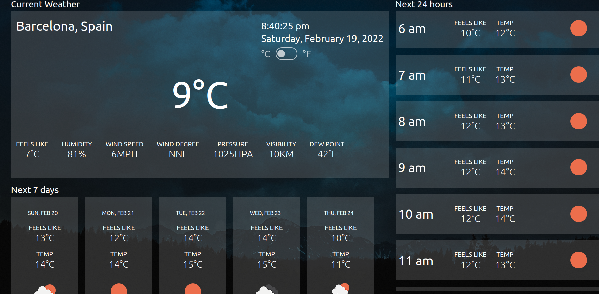

# Weather 
A simple weather app built with JavaScript, HTML and SCSS.

### Screenshot

### Pre Development
- Figma - for design visualization
- Obsidian - project preparation

### Used API(s)
- [OpenWeatherMap](https://openweathermap.org/) - weather forecast
- [LocationIQ](https://locationiq.com/) - fetching location API with coordination

### Credits

**Unsplash**

- Photo by [Felipe Palacio](https://unsplash.com/@swifteagle?utm_source=unsplash&utm_medium=referral&utm_content=creditCopyText) on [Unsplash](https://unsplash.com/collections/1445644/weather?utm_source=unsplash&utm_medium=referral&utm_content=creditCopyText)

- Photo by [Raimond Klavins](https://unsplash.com/@raimondklavins?utm_source=unsplash&utm_medium=referral&utm_content=creditCopyText) on [Unsplash](https://unsplash.com/s/photos/sunlight?utm_source=unsplash&utm_m

- Photo by [guille pozzi](https://unsplash.com/@guillepozzi?utm_source=unsplash&utm_medium=referral&utm_content=creditCopyText) on [Unsplash](https://unsplash.com/s/photos/snow-night?utm_source=unsplash&utm_medium=referral&utm_content=creditCopyText)

- Photo by [Andriyko Podilnyk](https://unsplash.com/@yirage?utm_source=unsplash&utm_medium=referral&utm_content=creditCopyText) on [Unsplash](https://unsplash.com/s/photos/cloudy-night?utm_source=unsplash&utm_medium=referral&utm_content=creditCopyText)

- Photo by [Courtney Chestnut](https://unsplash.com/@court_nut?utm_source=unsplash&utm_medium=referral&utm_content=creditCopyText) on [Unsplash](https://unsplash.com/s/photos/heavy-snow?utm_source=unsplash&utm_medium=referral&utm_content=creditCopyText)
